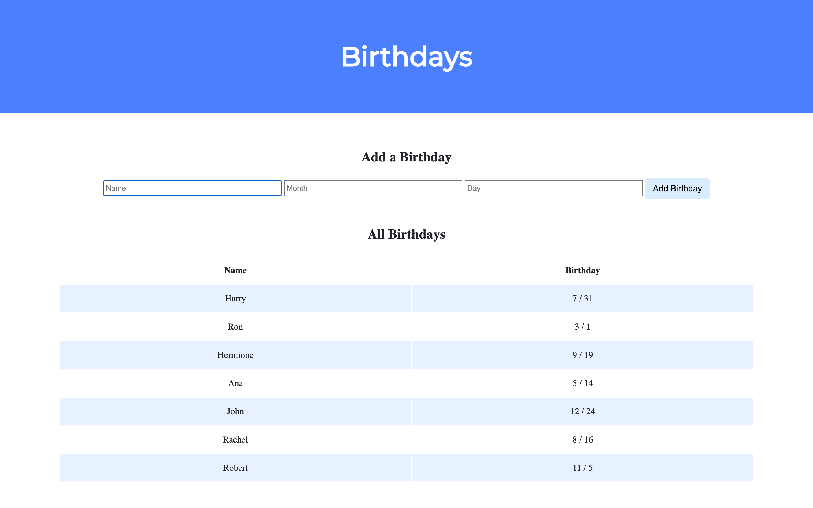

# Birthdays

Flask web application with the ability to add birthday entries to the database.

When the / route is requested via GET, this web app displays, in a table, all of the people in the database along with their birthdays.

