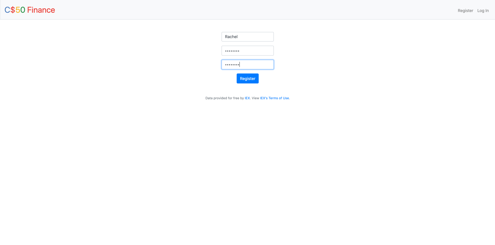
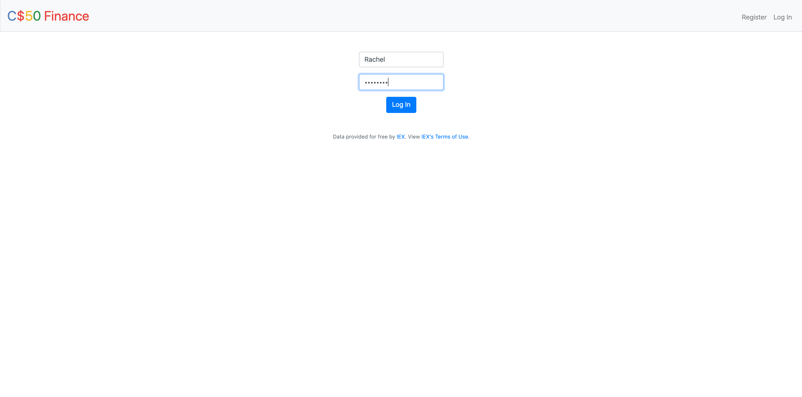
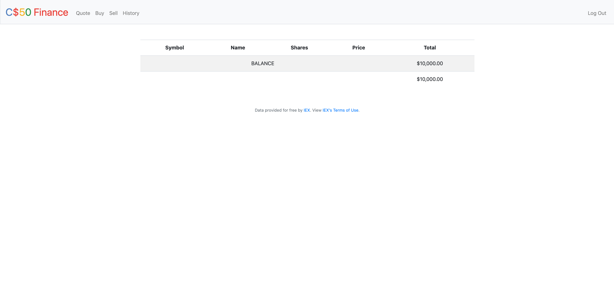
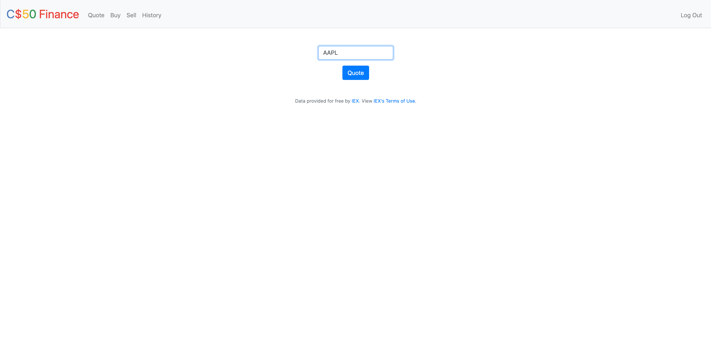
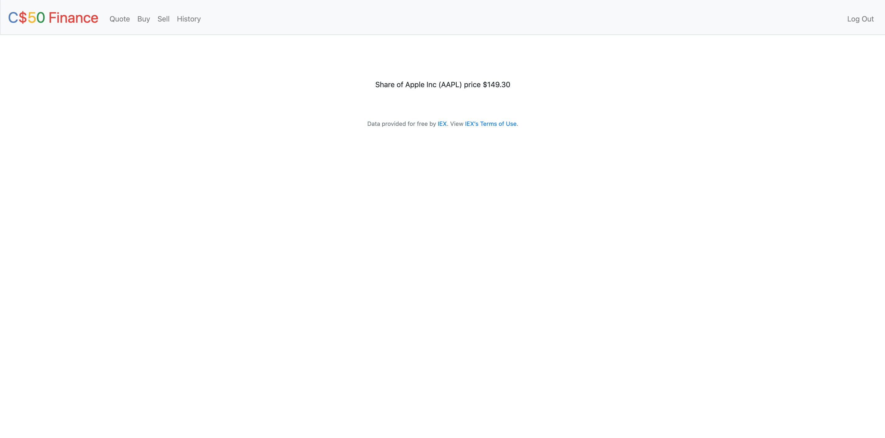
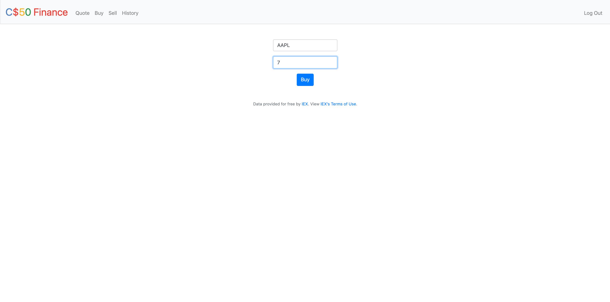

# C$50 Finance
### Web-based stock application

C$50 Finance, is a web-based application via which are managed portfolios of stocks. This tool allows to check
real stocks’ actual real-time prices as well as portfolios’ values. Moreover, it also lets to buy (okay, “buy”)
and sell (okay, “sell”) stocks (using stock symbols) by querying IEX for stocks’ prices. IEX allows to download
stock quotes.

App specification:
#

### Register new users

### Login to the website

### Main homepage once logged in with balance

### Quote for stocks

### Buy shares

### Sell shares

### History of purchases

### Main homepage with remaining shares and balance